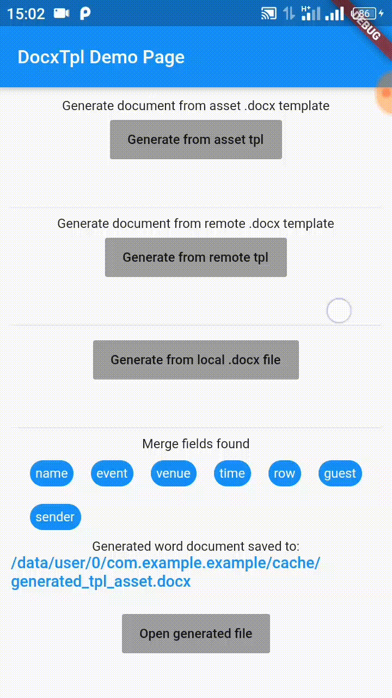
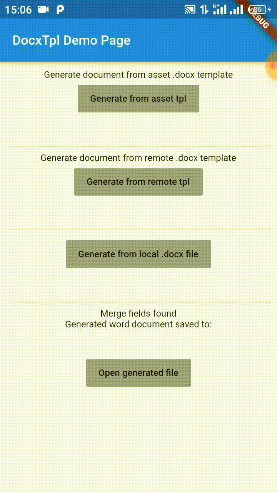
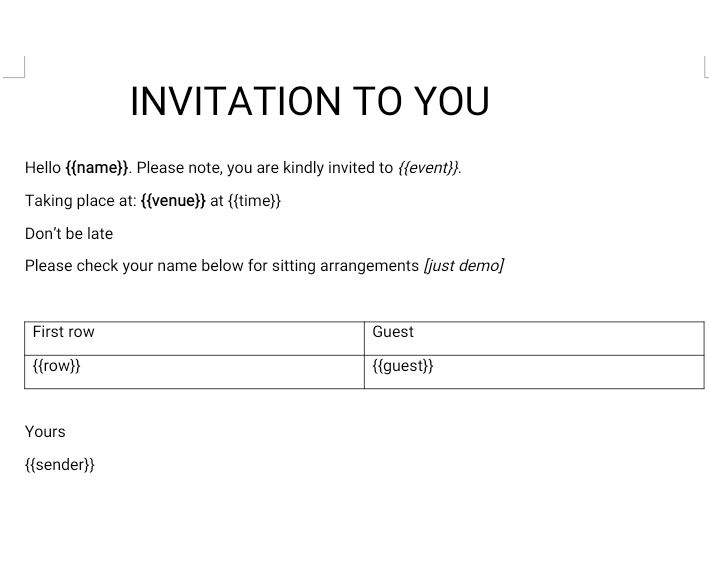
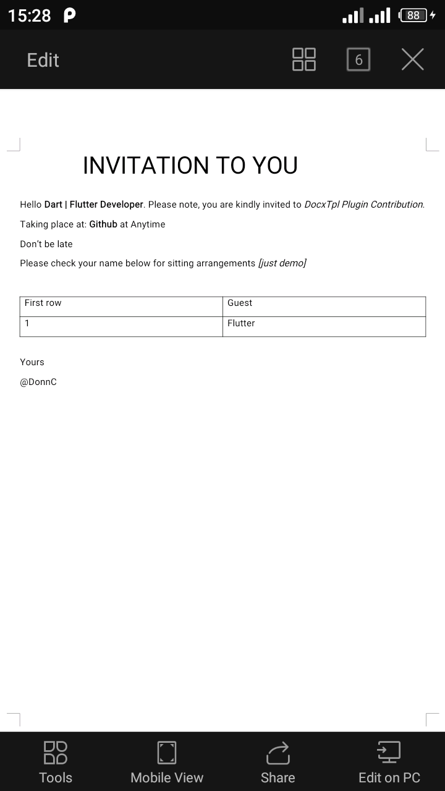

# example

A new Flutter project.
## screenshots
<table>
   <tr>
      <td> Generate From Asset template .docx</td>
      <td> Generate From Remote Template .docx</td>
      <td> Generate From Local Template .docx</td>
   </tr>
   <tr>
      <td></td>
      <td></td>
      <td></td>
   </tr>
</table>

### Template file before and after using `docxtpl` plugin
<table>
   <tr>
      <td> Before: word document template .docx</td>
      <td> After(with docxtpl plugin): template .docx</td>
   </tr>
   <tr>
      <td></td>
      <td></td>
   </tr>
</table>

### Example: Generate from .docx tpl
Make sure you have added your .docx word tpl asset file in `pubspec.yaml` file
```dart
   final DocxTpl docxTpl = DocxTpl(
      docxTemplate: 'assets/invite.docx',  // path where tpl file is
      isAssetFile: true,      // flag to true for tpl file from asset
      //isRemoteFile: true    // flag to true for tpl file from cloud
    );

   // fields corresponding to merge fields found to fill the template with
   var templateData = {
    'name': 'Dart | Flutter Developer',
    'event': 'DocxTpl Plugin Contribution',
    'venue': 'Github',
    'time': 'Anytime',
    'row': '1',
    'guest': 'Flutter',
    'sender': '@DonnC',
  };

   var response = await docxTpl.parseDocxTpl();

   print(response.mergeStatus);
   print(response.message);

    if(response.mergeStatus == MergeResponseStatus.Success) {
      // success, proceed
      // get merge fields extracted by the plugin to know which fields to fill
      var fields = docxTpl.getMergeFields();

      print('Template file fields found: ');
      print(fields);

      await docxTpl.writeMergeFields(data: templateData);

      var savedFile = await docxTpl.save('invitation.docx');
    }
```

## Result
See word document generated with this plugin [here](demo/generated_tpl.docx)

## Getting Started

This project is a starting point for a Flutter application.

A few resources to get you started if this is your first Flutter project:

- [Lab: Write your first Flutter app](https://flutter.dev/docs/get-started/codelab)
- [Cookbook: Useful Flutter samples](https://flutter.dev/docs/cookbook)

For help getting started with Flutter, view our
[online documentation](https://flutter.dev/docs), which offers tutorials,
samples, guidance on mobile development, and a full API reference.
